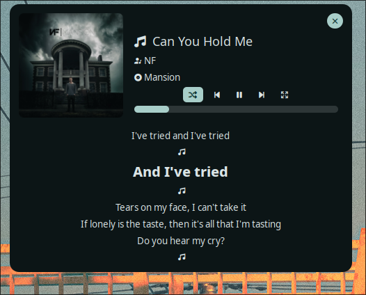

# waybar-lyric

[](https://pkg.go.dev/github.com/Nadim147c/waybar-lyric)
[](https://github.com/Nadim147c/waybar-lyric)
[](./LICENSE)
[](https://github.com/Nadim147c/waybar-lyric/tags)
[](https://github.com/Nadim147c/waybar-lyric/tags)

> [!IMPORTANT]
> 🔥 Found this useful? A quick star goes a long way.

A CLI tool that displays lyrics on your
[Waybar](https://github.com/Alexays/Waybar) for Linux systems.

> [!NOTE]  
> If you're using waybar for the first time checkout the [example](./example/waybar/) configuration.


> You can also use this tool to create interactive `eww` widget.

<details>
  <summary>Eww configuration!</summary>

Checkout the [example](./example/eww/) configuration.



</details>

## Description

`waybar-lyric` fetches and displays real-time lyrics on your Waybar. It provides a
scrolling lyrics display that syncs with your currently playing music, enhancing your
desktop music experience.

## Supported Players

- [Spotify](https://spotify.com)
- [YouTubeMusic](https://github.com/th-ch/youtube-music)
- [Amarok](https://amarok.kde.org/)
- [Amberol](https://apps.gnome.org/en/Amberol/)
- Firefox (Specific domains)
  - `open.spotify.com`
  - `music.youtube.com`

## Features

- Real-time display of the current song's lyrics
- Click to toggle play/pause
- Smart caching system:
  - Stores available lyrics locally to reduce API requests
  - Remembers songs without lyrics to prevent unnecessary API calls
- Custom waybar tooltip
- Configurable maximum text length
- Detailed logging options
- Profanity filter
  - Partial (`badword` -> `b*****d`)
  - Full (`badword` -> `*******`)

## Installation

### Prerequisites

- [Waybar](https://github.com/Alexays/Waybar)
- A working Spotify installation
- DBus connectivity

### Install

#### Prerequisites

- [go](https://go.dev/)

#### Installation

- From [AUR](https://aur.archlinux.org/packages); Recommended for Arch `btw` users.

```bash
yay -S waybar-lyric
```

or the latest git commit:

```bash
yay -S waybar-lyric-git
```

- Or from [Nixpkgs](https://github.com/NixOS/nixpkgs)

On NixOS:

```nix
environment.systemPackages = [
  pkgs.waybar-lyric
];
```

On Non NixOS:

```bash
# without flakes:
nix-env -iA nixpkgs.waybar-lyric
```

- With `go install`
  > Note: You have to make sure that `$GOPATH/bin/` in your system `PATH` before
  > running waybar.

```bash
go install github.com/Nadim147c/waybar-lyric@latest
```

- Or install from source

```bash
git clone https://github.com/Nadim147c/waybar-lyric.git
cd waybar-lyric
go install
```

## Configuration

### Waybar Configuration

The recommended way to configure waybar-lyric is to generate the configuration
snippet using the built-in command:

```bash
waybar-lyric --init
```

This will output the proper JSON configuration snippet that you can copy directly
into your Waybar `config.jsonc` file.

### Style Example

Add to your `style.css`:

```css
#custom-lyrics {
  color: #1db954;
  margin: 0 5px;
  padding: 0 10px;
}

#custom-lyrics.paused {
  color: #aaaaaa; /* Set custom color when paused */
}
```

## Troubleshooting

If you encounter issues:

1. Check that Spotify is running and connected
2. Run with verbose logging: `waybar-lyric -v --log-file=/tmp/waybar-lyric.log`
3. Verify DBus connectivity with: `dbus-send --print-reply --dest=org.mpris.MediaPlayer2.spotify /org/mpris/MediaPlayer2 org.freedesktop.DBus.Properties.Get string:org.mpris.MediaPlayer2.Player string:PlaybackStatus`

## License

This repository is licensed under [AGPL-3.0](./LICENSE). Thanks to
[LrcLib](https://lrclib.net/) for providing lyrics.

## Contributing

Contributions are welcome! Please feel free to submit a Pull Request.
